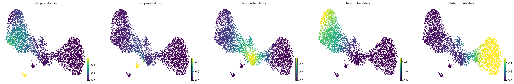
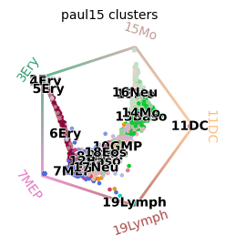

# cellrank2-fate-analysis


Two-prior direction fusion for [CellRank 2](https://github.com/theislab/cellrank)
fate mapping: Palantir pseudotime and `1 − CytoTRACE2_Score` combined as a
weighted sum of two soft-threshold `PseudotimeKernel`s, GPCCA macrostates /
terminal states / fate probabilities, and the audits that a five-round
execution campaign showed actually catch failures — packaged as one
deterministic entrypoint plus a 16-type publication figure set.

CellRank 2 itself answers "what will each cell become?" by turning a KNN
graph plus a direction prior into an absorbing Markov chain (Weiler et al.,
*Nature Methods* 2024; see [Citation](#citation)). This repository contributes
the campaign-verified fusion workflow on top of it: everything here was
measured, not asserted — 44 CellRank models, 17 prerequisite runs, 46
stability perturbations, and 8 source-code audits, all with on-disk evidence
(`references/campaign-replay.md`).

| fate probabilities (paul15) | circular projection |
|---|---|
|  |  |

## What you get

- **Fused direction prior.** `(1−w)·K_palantir + w·K_ct2` where `ct2_time =
  1 − CytoTRACE2_Score`; both kernels use the soft threshold scheme
  (b=10, ν=0.5). The built-in `CytoTRACEKernel` is deliberately **not**
  used — it re-implements CytoTRACE v1, double-counts the direction prior,
  and fails on log data and restricted gene panels (pitfalls #3/#4).
- **Audited GPCCA output.** Terminal states, fate probabilities, and a
  `audit.json` carrying four numeric gates, an edge-level direction-conflict
  table, block-monotonicity of cluster means, and the GPCCA spectrum.
- **Determinism.** Same input + parameters ⇒ bit-identical fate matrices
  (reference double-runs: Jaccard 1.0 on both validation datasets).
- **A 16-type publication figure set**, every PNG shipped with a same-name
  CSV of the plotted data (`references/figures.md`).
- **Two ways to run.** Standalone CLI on any prior-bearing h5ad, or as an
  OmicOS community skill (`SKILL.md`, thin entry, references on demand).

## How it works

`scripts/run_cellrank2_fusion.py` (exit 0 = gates passed; 1 = gate/run
failure; 2 = input contract violation):

1. Load h5ad; validate unique cell ids, prior columns present, no NaN
   (incomplete priors are refused, never imputed).
2. Homogeneous preprocessing: `normalize_total` (per-cell median) →
   `palantir.preprocess.log_transform` → HVG top 1500 (`cell_ranger`) →
   PCA 50 → kNN graph.
3. Two `PseudotimeKernel`s (Palantir pseudotime; `1−CytoTRACE2_Score`),
   fused by weight, GPCCA with explicit `--n-states` → terminal states →
   fate probabilities (scipy `gmres`, no PETSc dependency).
4. Numeric gates (finite / non-negative / row sums ≈ 1 at 1e-3),
   direction-conflict audit, block-monotonicity table, spectrum record →
   `audit.json` + CSVs + transition matrix + fate UMAP.

`scripts/make_figures.py` rebuilds the same deterministic model and renders
the 16 figure types — native cellrank plotting first, manual fallback per
figure, `figure_log.txt` records native-vs-fallback for every panel.

## Producing the prior columns

The two direction priors are produced by two prerequisite skills (this is
the verified path — do not improvise substitutes):

| prior column | produced by | notes |
|---|---|---|
| `palantir_pseudotime` | [palantir-fate-analysis](https://github.com/LCGaoZzz/myskills/tree/main/palantir-fate-analysis) | raw-count h5ad; annotation-driven terminals preferred; writes `palantir_audit.json` |
| `CytoTRACE2_Score` | [cytotrace2-fast](https://github.com/LCGaoZzz/myskills/tree/main/cytotrace2-fast) skill / [cytotrace2-fast](https://github.com/LCGaoZzz/cytotrace2-fast) binary | raw counts/CPM/TPM only (never log); species `mouse`/`human`; record seed & batch regime |

Align both prior columns by cell id against the same cell set before
running (the entrypoint refuses NaN or missing priors). Never feed
log-transformed counts.

## Installation

```bash
pip install -r requirements.txt            # cellrank>=2.0,<2.1 palantir>=1.4,<1.5 scanpy ...
pip install -r requirements-reproducibility.txt   # exact verified pins (cellrank==2.0.7 ...)
```

Python 3.11; verified version matrix and solver fallbacks in
[`references/runtime.md`](references/runtime.md). Without petsc4py/slepc4py
the eigendecomposition falls back to `brandts` and the fate solve uses
scipy `gmres` — both fine at ≤3k cells.

## Quickstart

```bash
# 1) fate analysis: audited runner (defaults shown; paul15 example)
python scripts/run_cellrank2_fusion.py \
    --h5ad working.h5ad --cluster-key paul15_clusters \
    --n-neighbors 30 --threshold soft --w-ct2 0.5 --n-states 5 \
    --eigengap --seed 0 --out-dir cr_out

# 2) publication figures (same deterministic model, 16 types, PNG+CSV)
python scripts/make_figures.py \
    --h5ad working.h5ad --cluster-key paul15_clusters \
    --w-ct2 0.5 --n-states 5 --threshold soft --out-dir figs
```

Runner outputs land in `--out-dir`: `audit.json`, `fate_probabilities.csv`,
`terminal_members.csv`, `transition_matrix.npz`, `fig_fate_umap.png`(+csv).
A fully reproduced paul15 example (audit, outputs, all figures) is checked
in under [`examples/paul15/`](examples/paul15/).

A production-scale case study — a 265,480-cell pan-cancer Mono→TAM atlas
(batch-structured, reused Harmony geometry, PETSc krylov path, explicit
terminal selection) with its final result tables checked in — lives under
[`examples/G1a_Myeloid_MonoTAM/`](examples/G1a_Myeloid_MonoTAM/); every
output schema is documented in
[`docs/OUTPUT_FORMATS.md`](docs/OUTPUT_FORMATS.md).

Pass an explicit `--n-states` for the primary model — auto selection
(`n_states=None`, cellrank's `_eigengap` criterion) collapsed to n=1 on
ct2-weighted kernels in validation while the fixed-K model was healthy;
`--eigengap` records the auto choice as a contrast column only.

## What the audits are for

- **Numeric gate (finite / non-negative / row-sum≈1).** In the campaign
  every instability traced to state selection or weights, never the solver;
  the gate must stay green before any interpretation.
- **Direction-conflict audit.** Edge-level disagreement between the two
  priors, overall and per cluster. Near-0.5 conflict with near-0 rank
  correlation is a structural property of the two priors — it is NOT
  noise, NOT reversibility (both candidate explanations were tested and
  falsified).
- **Block-monotonicity table.** Cluster-mean `ct2_time` along the lineage
  order. If it decreases toward the mature end (as on paul15 short
  branches), that lineage is unreachable under ct2-weighted kernels at any
  weight — check before choosing fusion weights.
- **Weight regime boundary.** On paul15 the terminal set switches regime
  between `w_ct2` 0.4 and 0.6; equal weight sits on the boundary. Sweep
  weights when a lineage is missing.

## Verified results (campaign 2026-09-18)

Two datasets: D1 mouse pancreas epithelium (2,850 cells, cytotrace2
vignette source) and D2 paul15 mouse myeloid (2,730 × 3,451 raw counts).
Fate-probability agreement vs the reference run (Spearman ρ):

| perturbation axis | D1 | D2 |
|---|---:|---:|
| reference double-run (determinism) | 1.000 | 1.000 |
| neighbors 15 / 50 | 0.892 / 0.985 | 0.984 / 0.994 |
| hard vs soft threshold | 0.924 (cell-set Jaccard 0.584) | 0.975 |
| weight 0.25 / 0.75 | 0.949 / 0.935 | 0.933 / 0.968 |
| n_states K±1 | 0.961 / 0.925 | 0.965 / 0.352 (K=8 mismatch) |
| **eigengap auto selection** | **n=1, ρ=−0.737** | n=5, healthy |
| 80% cell holdout ×3 | 0.889–0.975 | 0.972–0.982 |

Numeric gates: 44/44 runs green. Edge-level prior conflict: D1 0.474,
D2 0.491, with prior-rank Spearman ≈ 0 (the priors are nearly orthogonal
at edge level yet partially agree at terminal-state level — reconciled by
cluster-mean block order; `references/campaign-replay.md`). Runtime:
~23–27 s per dataset (2.7–2.9k cells). Lineage-driver sanity anchors:
D1 Beta-terminal drivers include *Neurod1*, Alpha *Cpe*; D2 11DC
*H2-Eb1/H2-Aa/Cd74* (MHC-II), 19Lymph *Ccl5/Ctsw/Cd2*.

Known limits are listed honestly in
[`references/boundaries.md`](references/boundaries.md): fate probabilities
are model-conditional quantities, not measured transition rates; validated
on cellrank 2.0.7 / palantir 1.4.5; no per-sample auditing (no sample
columns in the validation data).

## Documentation (references on demand)

| file | read when |
|---|---|
| [`references/workflow-sop.md`](references/workflow-sop.md) | running end to end, alignment rules, stability-matrix template |
| [`references/pitfalls.md`](references/pitfalls.md) | something errors or looks silently wrong — 18 symptom → cause → fix entries with real traces |
| [`references/figures.md`](references/figures.md) | producing final figures — the 16 types, what each licenses you to conclude, PNG+CSV policy |
| [`references/runtime.md`](references/runtime.md) | installing, version matrix, solver fallbacks, cytotrace2-fast build |
| [`references/campaign-replay.md`](references/campaign-replay.md) | re-deriving or extending: the 5-round loop, what was measured, what was refuted |
| [`references/boundaries.md`](references/boundaries.md) | applicability limits and open items |
| [`contracts/reproducibility.v1.json`](contracts/reproducibility.v1.json) | the reproducibility contract |
| [`docs/OUTPUT_FORMATS.md`](docs/OUTPUT_FORMATS.md) | consuming run outputs — schema of every artifact, with a filled example per file |

Integrity: `REPRODUCIBILITY_SOURCE.sha256` covers the 12 skill source files
(`sha256sum -c` from the repo root).

## Related work

| project | role here |
|---|---|
| [cellrank](https://github.com/theislab/cellrank) | the fate-mapping framework this workflow drives (kernels, GPCCA, plotting) |
| [palantir](https://github.com/dpeerlab/Palantir) (Setty et al. 2019) | pseudotime prior source |
| [cytotrace2](https://github.com/digitalcytometry/cytotrace2) (Kang et al. 2025) | developmental-potential prior source |
| [cytotrace2-fast](https://github.com/LCGaoZzz/cytotrace2-fast) | fast Rust CytoTRACE 2 binary used to produce the score column |
| [palantir-fate-analysis](https://github.com/LCGaoZzz/myskills/tree/main/palantir-fate-analysis) · [cytotrace2-fast skill](https://github.com/LCGaoZzz/myskills/tree/main/cytotrace2-fast) | prerequisite skills that produce the prior columns |

## Citation

This repository is original workflow/audit code; the methods belong to the
upstream projects. If you use it, cite:

> Weiler, Lange, Peidli, Klein et al. CellRank 2: unified fate mapping in
> multiview single-cell data. *Nature Methods* 21(7):1196–1205, 2024.
> doi:[10.1038/s41592-024-02303-9](https://doi.org/10.1038/s41592-024-02303-9)

> Setty M, Kiseliovas V, Levine J, Gayoso A, Mazutis L, Pe'er D.
> Characterization of cell fate probabilities in single-cell data with
> Palantir. *Nature Biotechnology* 37:320–327, 2019.
> doi:[10.1038/s41587-019-0068-4](https://doi.org/10.1038/s41587-019-0068-4)

> Kang M, Gulati GS, Brown EL, et al. Improved reconstruction of
> single-cell developmental potential with CytoTRACE 2. *Nature Methods*,
> 2025. doi:[10.1038/s41592-025-02857-2](https://doi.org/10.1038/s41592-025-02857-2)

## License

MIT — see [LICENSE](LICENSE). The upstream tools keep their own licenses
(cellrank BSD-3-Clause, palantir MIT, CytoTRACE 2 a custom non-commercial
license for its models/assets); nothing from them is redistributed here.
